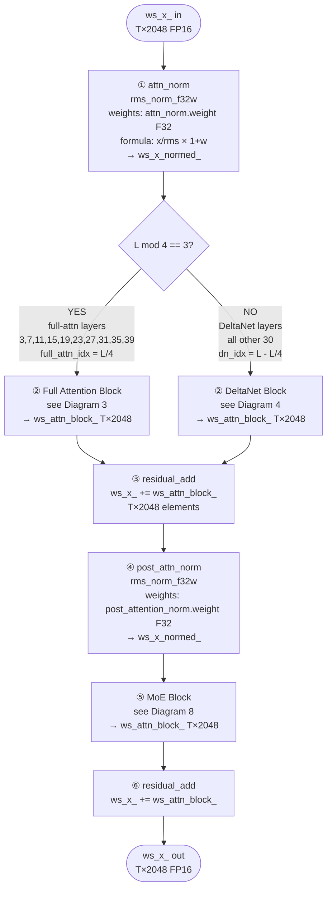
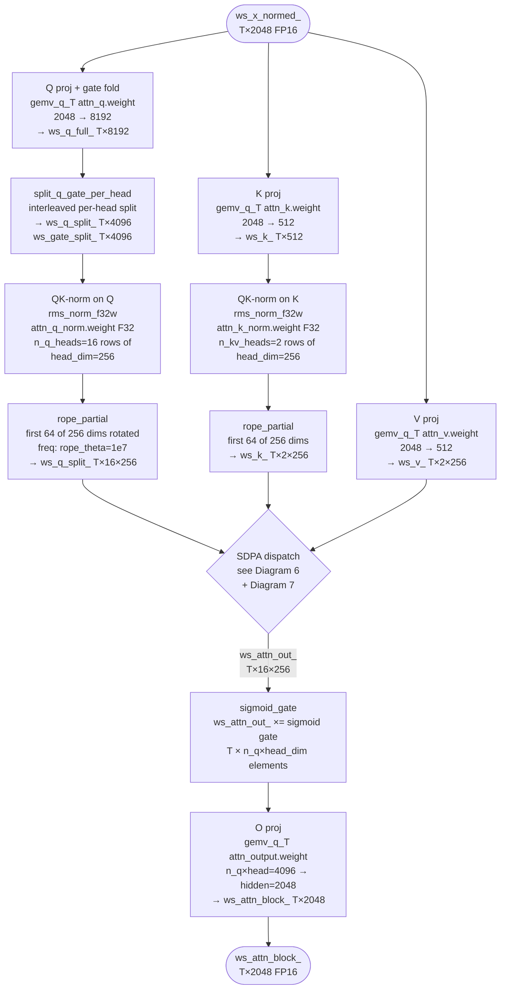
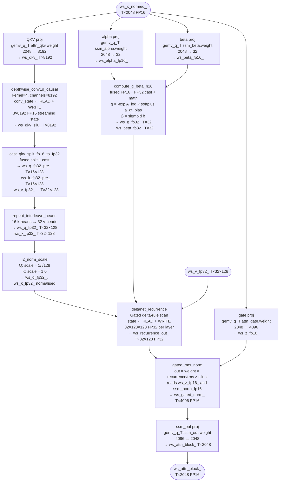
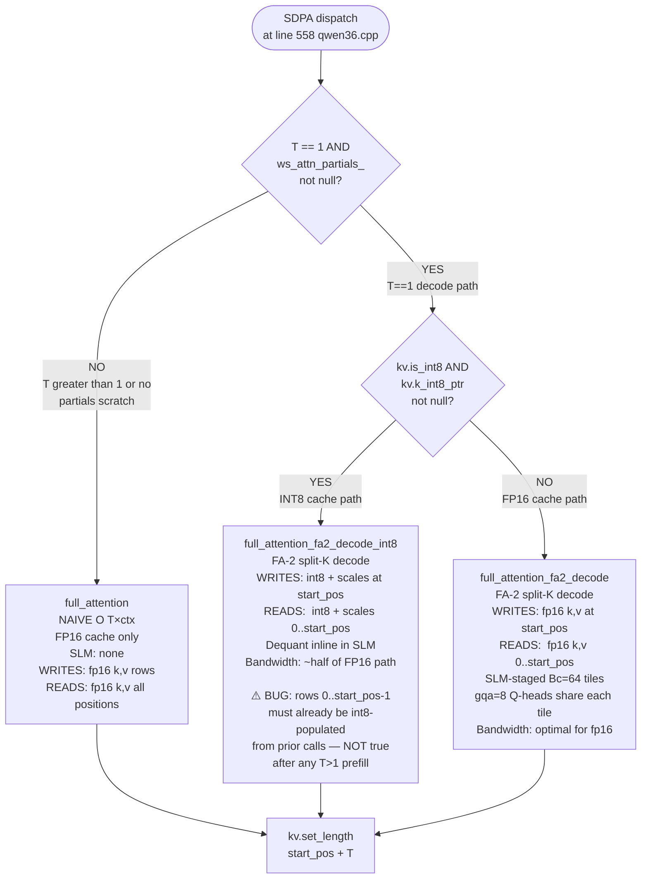
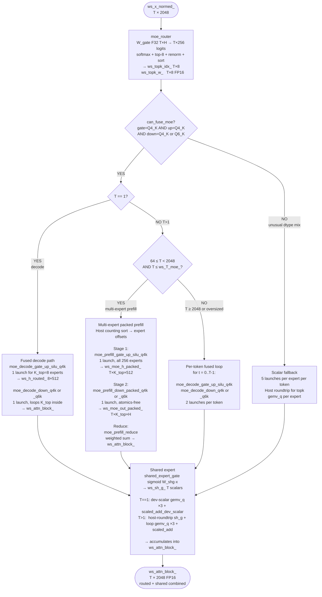

# IE Inference Engine — Complete Architecture Diagrams

**Model:** Qwen3.6-35B-A3B  
**Hardware:** Intel Arc Pro B70 (Battlemage / BMG-G31 C0)  
**Runtime:** SYCL / Level Zero  
**Source verified:** 2026-05-01 (reading actual src/model/qwen36.cpp, src/ops/attention.cpp, include/ie/*)

---

## Table of Contents

1. [Top-Level Forward Pass](#1-top-level-forward-pass)
2. [Per-Layer Structure (all 40 layers)](#2-per-layer-structure)
3. [Full Attention Layer Detail (L%4 == 3)](#3-full-attention-layer-detail)
4. [DeltaNet Layer Detail (L%4 != 3)](#4-deltanet-layer-detail)
5. [KV Cache: Every Write and Read Point](#5-kv-cache-every-write-and-read-point)
6. [INT8 vs FP16 Decision Tree](#6-int8-vs-fp16-decision-tree)
7. [T=1 vs T>1 Dispatch Summary](#7-t1-vs-t1-dispatch-summary)
8. [MoE Dispatch Paths (All Branches)](#8-moe-dispatch-paths)
9. [GEMM/GEMV Dispatch Logic](#9-gemmgemv-dispatch-logic)
10. [Complete Kernel Inventory](#10-complete-kernel-inventory)
11. [Memory Layout Reference](#11-memory-layout-reference)

---

## 1. Top-Level Forward Pass

```
prompt (string)
      │
      ▼
┌─────────────────────────────────────────────────────┐
│  TOKENIZER  (src/tokenizer/tokenizer.cpp)            │
│  BPE / tiktoken-compatible                          │
│  Output: int32[T]  token IDs  (host)                │
└─────────────────────────────────────────────────────┘
      │  int32[T] copied to device  →  input_ids[T]
      ▼
┌─────────────────────────────────────────────────────┐
│  EMBEDDING LOOKUP                                    │
│  Dispatched by token_embd dtype:                    │
│    Q4_K → embedding_lookup_q4k                      │
│    Q6_K → embedding_lookup_q6k                      │
│  Weights: token_embd[vocab=248320, hidden=2048]     │
│  Output: ws_x_[T, 2048]  FP16                       │
└─────────────────────────────────────────────────────┘
      │  ws_x_[T, 2048]  FP16
      ▼
┌─────────────────────────────────────────────────────┐
│  40 LAYERS  (L = 0 … 39)                            │
│                                                     │
│  Full-attn layers (L%4 == 3):  3,7,11,15,19,        │
│                                23,27,31,35,39        │
│  DeltaNet layers (L%4 != 3):   all other 30         │
│                                                     │
│  Each layer:                                        │
│    ① attn_norm  (rms_norm_f32w, 1+w style)          │
│    ② FullAttn or DeltaNet  →  ws_attn_block_        │
│    ③ residual_add  (ws_x_ += ws_attn_block_)        │
│    ④ post_attn_norm  (rms_norm_f32w)                │
│    ⑤ MoE block  →  ws_attn_block_                   │
│    ⑥ residual_add  (ws_x_ += ws_attn_block_)        │
└─────────────────────────────────────────────────────┘
      │  ws_x_[T, 2048]  FP16
      ▼
┌─────────────────────────────────────────────────────┐
│  FINAL NORM                                         │
│  rms_norm_f32w(ws_x_, output_norm.weight F32)       │
│  Output: ws_x_normed_[T, 2048]  FP16               │
└─────────────────────────────────────────────────────┘
      │  last token only: ws_x_normed_[T-1, 2048]
      ▼
┌─────────────────────────────────────────────────────┐
│  LM HEAD GEMV                                        │
│  gemv_q(ws_x_normed_[T-1], output.weight)           │
│  Weights: output.weight[vocab=248320, 2048] Q4_K/Q6K│
│  (XMX tried, ~5% SLOWER for M=1 — scalar wins)     │
│  Output: out_logits[248320]  FP16                   │
└─────────────────────────────────────────────────────┘
      │  out_logits[248320]  FP16
      ▼
┌─────────────────────────────────────────────────────┐
│  SAMPLER  (src/ops/sampling.cpp)                    │
│                                                     │
│  Optional: repetition_penalty (in-place)            │
│  Greedy:   sample_argmax                            │
│  Stochastic: sample_softmax_topk_topp               │
│             (temperature → top-k → top-p → min-p → │
│              multinomial from rng_state)            │
└─────────────────────────────────────────────────────┘
      │
      ▼
  next token ID  (int32, device)
```

---

## 2. Per-Layer Structure



---

## 3. Full Attention Layer Detail

**Applies to layers:** 3, 7, 11, 15, 19, 23, 27, 31, 35, 39  
**KV cache index:** `full_attn_idx = L / 4`  (0 … 9)



---

## 4. DeltaNet Layer Detail

**Applies to:** all layers where L%4 != 3 (30 out of 40 layers)  
**Recurrent state index:** `dn_idx = L - (L / full_attn_interval)`



---

## 5. KV Cache: Every Write and Read Point

### Cache Layout

```
FP16 cache  (always allocated):
  k_cache: [L_full=10, n_kv_heads=2, max_ctx, head_dim=256]  FP16
  v_cache: [L_full=10, n_kv_heads=2, max_ctx, head_dim=256]  FP16

INT8 shadow  (only when KvCacheConfig.use_int8 == true):
  k_int8_cache: [L_full=10, n_kv_heads=2, max_ctx, head_dim=256]  INT8
  v_int8_cache: [L_full=10, n_kv_heads=2, max_ctx, head_dim=256]  INT8
  k_scales:     [L_full=10, n_kv_heads=2, max_ctx]                FP16
  v_scales:     [L_full=10, n_kv_heads=2, max_ctx]                FP16
  (1 FP16 scale = max_abs/127 per kv_head×position row)

Layer index mapping (full_attn_idx = L / 4):
  L= 3 → idx=0    L= 7 → idx=1    L=11 → idx=2    L=15 → idx=3
  L=19 → idx=4    L=23 → idx=5    L=27 → idx=6    L=31 → idx=7
  L=35 → idx=8    L=39 → idx=9

Per-layer byte offsets in the flat cache buffer:
  per_layer = n_kv_heads × max_ctx × head_dim × sizeof(fp16)
  k_cache for layer idx: k_ptr() + per_layer × idx
```

### Kernel-by-Kernel Write/Read Map

```
┌──────────────────────────────────────────────────────────────────────────────┐
│  full_attention  (T > 1  ──  prefill path)                                   │
│                                                                              │
│  WRITE:  k_cache[kv, start_pos..start_pos+T-1, :]  =  k_in[T, kv, :]       │
│          v_cache[kv, start_pos..start_pos+T-1, :]  =  v_in[T, kv, :]       │
│          ► FP16 ONLY.  INT8 cache not touched.                               │
│                                                                              │
│  READ:   k_cache[kv, 0..start_pos+T-1, :]  (all positions, fp16)            │
│          v_cache[kv, 0..start_pos+T-1, :]  (all positions, fp16)            │
│                                                                              │
│  ⚠️  CRITICAL BUG SURFACE:                                                  │
│     If use_int8=true and later decode (T=1) selects INT8 path,               │
│     positions 0..start_pos+T-1 were never written to INT8 cache.            │
│     Decode will read UNINITIALIZED INT8 values → silent wrong logits.       │
└──────────────────────────────────────────────────────────────────────────────┘

┌──────────────────────────────────────────────────────────────────────────────┐
│  full_attention_fa2_decode  (T == 1, is_int8 == false)                       │
│                                                                              │
│  WRITE:  k_cache[kv, start_pos, :]  =  k_in[kv, :]   (fp16)                │
│          v_cache[kv, start_pos, :]  =  v_in[kv, :]   (fp16)                │
│                                                                              │
│  READ:   k_cache[kv, 0..start_pos, :]   (all ctx len positions, fp16)       │
│          v_cache[kv, 0..start_pos, :]                                        │
│          Access pattern: Bc=64 tiles, CHUNKS_PER_WG=8 tiles per WG          │
│          SLM-staged: each (kv_head × chunk) tile loaded once into SLM       │
│          gqa=8 Q-heads share each SLM tile → 8× KV bandwidth reduction     │
└──────────────────────────────────────────────────────────────────────────────┘

┌──────────────────────────────────────────────────────────────────────────────┐
│  full_attention_fa2_decode_int8  (T == 1, is_int8 == true)                  │
│                                                                              │
│  WRITE:  k_int8_cache[kv, start_pos, :]  =  round(k_in × 127/maxabs)       │
│          v_int8_cache[kv, start_pos, :]  =  round(v_in × 127/maxabs)       │
│          k_scales[kv, start_pos]  =  fp16(maxabs_k / 127)                   │
│          v_scales[kv, start_pos]  =  fp16(maxabs_v / 127)                   │
│          k_fp16_shadow[kv, start_pos, :]  =  k_in   (only if shadow != null)│
│          NOTE: in qwen36.cpp shadow pointers are passed as nullptr           │
│                → fp16 shadow is NOT written by this path                    │
│                                                                              │
│  READ:   k_int8_cache[kv, 0..start_pos, :]  (all ctx len, INT8)             │
│          v_int8_cache[kv, 0..start_pos, :]                                   │
│          k_scales[kv, 0..start_pos]                                          │
│          v_scales[kv, 0..start_pos]                                          │
│          Dequant inline: fp16(int8 × scale) per element in SLM               │
│          KV bandwidth: ~half of fp16 path (256B vs 512B per row)            │
│                                                                              │
│  ⚠️  ASSUMES rows [0..start_pos-1] were INT8-populated on previous calls.  │
│     If any T>1 prefill ran before this decode, those rows are zeros/garbage.│
└──────────────────────────────────────────────────────────────────────────────┘
```

### State Update After Each SDPA Call

```
After every attention kernel call (any path):
  kv.set_length(full_attn_idx, start_pos + T)
  → host-side length counter, used to know current ctx depth
```

---

## 6. INT8 vs FP16 Decision Tree



---

## 7. T=1 vs T>1 Dispatch Summary

This table summarises every place in the forward pass where T=1 vs T>1 produces a different code path.

| Location | T=1 path | T>1 path | Notes |
|---|---|---|---|
| **gemv_q_T dispatcher** | `gemv_q4_K` or `gemv_q6_K` (scalar GEMV) | `gemm_q4_K` or `gemm_q4_K_xmx` with M_TILE=8 chunking | XMX enabled when N%64==0 && K%256==0 and IE_NO_XMX not set |
| **SDPA** | FA-2 split-K (`full_attention_fa2_decode` or `_int8` variant) | Naive `full_attention` (O(T·ctx), fp16 only) | INT8 path only reachable at T=1 |
| **MoE routed experts** | Fused decode: 2 kernels for all K_top=8 experts | Branched by T: 64≤T<2048 → multi-expert packed; T≥2048 → per-token fused loop | See Diagram 8 |
| **Shared expert** | `gemv_q` (single token, dev-scalar gate) | Per-token loop + host roundtrip for sh_g | decode avoids `q.memcpy` wait |
| **Tokenizer positon array** | 1-element int32 memcpy to device | T-element memcpy to device | Both synchronous `.wait()` |
| **INT8 KV path** | Available (FA-2 int8 kernel) | **NOT available** — always fp16 | ⚠️ Root of the INT8 prefill bug |

---

## 8. MoE Dispatch Paths

**Every layer has MoE.** Router selects top-8 of 256 experts per token.



---

## 9. GEMM/GEMV Dispatch Logic

`gemv_q_T` in qwen36.cpp is the central dispatcher for all weight projections.

```
gemv_q_T(q, A[T,K], W[K,N], y[T,N], K, N, T)
│
├── T == 0 → return (no-op)
│
├── T == 1 → gemv_q(single-row dispatch)
│              ├── W.dt == Q4_K → gemv_q4_K
│              └── W.dt == Q6_K → gemv_q6_K
│
└── T > 1  (only for Q4_K; Q6_K always falls through to scalar loop)
           │
           ├── W.dt == Q4_K:
           │    for m = 0, 8, 16, ... (M_TILE=8 chunks):
           │      mc = min(8, T - m)
           │      use_xmx = !IE_NO_XMX AND N%64==0 AND K%256==0
           │      ├── use_xmx=true  → gemm_q4_K_xmx (joint_matrix dpas)
           │      └── use_xmx=false → gemm_q4_K      (scalar SLM-staged)
           │
           └── W.dt == Q6_K or other: scalar per-row loop
                for t = 0..T-1: gemv_q6_K (or gemv_q4_K for Q4_K)

Notes:
  gemm_q4_K_xmx: Uses Intel joint_matrix (XMX/DPAS) instructions.
                 Amortizes Q4_K dequant cost across M_TILE rows.
                 For MoE multi-expert prefill: tested but ~10-15% SLOWER than
                 scalar for fragmented multi-expert workloads; SLM round-trip
                 for dequant costs more than DPAS savings in that pattern.

  lm_head GEMV:  Always uses scalar gemv_q (M=1); XMX tried, consistently
                 ~5% slower for M=1. Scalar inline-dequant wins.
```

---

## 10. Complete Kernel Inventory

**Status key:**
- ✅ Active — on the hot path in production runs
- 🔶 Active with caveats — works but has a known issue or is superseded
- 🧪 Experimental — gated or not yet wired into the forward pass
- ❌ Dead code — wrapped in `if(false)` or otherwise unreachable

### Embedding & Normalization

| Kernel | Source File | Status | Shape / Notes |
|--------|-------------|--------|---------------|
| `embedding_lookup_q4k` | ops/embedding.cpp | ✅ Active | vocab×2048 Q4_K → T×2048 FP16 |
| `embedding_lookup_q6k` | ops/embedding.cpp | ✅ Active | vocab×2048 Q6_K → T×2048 FP16 |
| `rms_norm_f32w` | ops/elementwise.cpp | ✅ Active | Gemma3-style 1+w; used for attn_norm, post_attn_norm, qk_norm (Q and K), final_norm |

### Positional Encoding & Projection Helpers

| Kernel | Source File | Status | Shape / Notes |
|--------|-------------|--------|---------------|
| `rope_partial` | ops/elementwise.cpp | ✅ Active | First 64 of 256 dims rotated; theta=1e7; T×n_heads×256 |
| `split_q_gate_per_head` | ops/elementwise.cpp | ✅ Active | Per-head interleaved Q/gate split; T×16×512 → T×16×256 + T×16×256 |
| `sigmoid_gate` | ops/elementwise.cpp | ✅ Active | attn_output_gate quirk; element-wise ×sigmoid(gate) |
| `cast_fp32_to_fp16` | ops/elementwise.cpp | ✅ Active | Model load: ssm_conv1d, ssm_norm cast |
| `cast_fp16_to_fp32` | ops/elementwise.cpp | ✅ Active | DeltaNet QKV intermediate |
| `cast_qkv_split_fp16_to_fp32` | ops/elementwise.cpp | ✅ Active | Fused 3-way split + cast for DeltaNet; 1 launch |
| `repeat_interleave_heads` | ops/elementwise.cpp | ✅ Active | DeltaNet: 16 k-heads → 32 v-heads (GQA expand) |

### Element-Wise Arithmetic

| Kernel | Source File | Status | Notes |
|--------|-------------|--------|-------|
| `residual_add` | ops/elementwise.cpp | ✅ Active | y = a + b; called twice per layer (40×2 = 80 calls per forward) |
| `swiglu` | ops/elementwise.cpp | ✅ Active | silu(gate)×up for MoE expert FFN |
| `silu` | ops/elementwise.cpp | ✅ Active | Standalone; also available |
| `scaled_add` | ops/elementwise.cpp | ✅ Active | y += scale×x; host scalar; MoE output accumulate (T>1 shared expert) |
| `scaled_add_dev_scalar` | ops/elementwise.cpp | ✅ Active | Same but reads scale from device; T=1 shared expert — no host roundtrip |

### Attention Kernels

| Kernel | Source File | Status | When Used | Notes |
|--------|-------------|--------|-----------|-------|
| `full_attention` | ops/attention.cpp | ✅ Active | T>1 prefill | Naive O(T×ctx), correctness reference, fp16 cache only |
| `full_attention_fa2_decode` | ops/attention.cpp | ✅ Active | T=1, fp16 KV | FA-2 split-K, 2-pass; Bc=64; CHUNKS_PER_WG=8; SLM-staged KV |
| `full_attention_fa2_decode_int8` | ops/attention.cpp | 🔶 Buggy | T=1, INT8 KV flag | Correct for pure decode sessions; broken after any T>1 prefill (INT8 rows never populated by prefill path) |

### GEMV / GEMM Kernels

| Kernel | Source File | Status | When Used | Notes |
|--------|-------------|--------|-----------|-------|
| `gemv_q4_K` | ops/gemv_q4k.cpp | ✅ Active | T=1, Q4_K weights | ~92% effective BW; decode hot path |
| `gemv_q6_K` | ops/gemv_q6k.cpp | ✅ Active | T=1, Q6_K weights | |
| `gemm_q4_K` | ops/gemv_q4k.cpp | ✅ Active | T>1, Q4_K, no XMX | M_TILE=8, SLM-staged activations |
| `gemm_q4_K_xmx` | ops/gemm_q4k_xmx.cpp | ✅ Active | T>1, Q4_K, N%64==0, K%256==0 | joint_matrix dpas; needs IE_NO_XMX=0 |
| `gemm_q6_K_xmx` | ops/gemm_q4k_xmx.cpp | 🔶 Declared | (not called from qwen36.cpp) | Prototype present |
| `gemm_fp16` | ops/gemm_fp16.cpp | ✅ Active | Dense FP16 GEMM reference | Phase 3 baseline |
| `gemm_q4k_esimd` | ops/gemm_q4k_esimd.cpp | 🧪 Experimental | Not wired into forward pass | v2.0 ESIMD research; untracked file |

### ESIMD Experimental

| Kernel | Source File | Status | Notes |
|--------|-------------|--------|-------|
| `esimd_block2d_smoke_tile256` | ops/attention.cpp | 🧪 Disabled | Guarded by `#ifdef IE_ENABLE_UNSAFE_BMG_ESIMD_EXPERIMENTS`; every variant (2D block, 1D block, per-lane, SLM) causes UR_RESULT_ERROR_DEVICE_LOST on BMG-G31 C0. Not to be enabled. |

### DeltaNet Kernels

| Kernel | Source File | Status | Notes |
|--------|-------------|--------|-------|
| `depthwise_conv1d_causal` | ops/conv1d.cpp | ✅ Active | kernel=4, 8192 channels; streaming conv_state updated in-place |
| `compute_g_beta_h16` | ops/elementwise.cpp | ✅ Active | Fused FP16-input variant; eliminates 2 separate cast launches |
| `l2_norm_scale` | ops/elementwise.cpp | ✅ Active | Q (scale=1/√128) and K (scale=1.0) normalization |
| `deltanet_recurrence` | ops/deltanet.cpp | ✅ Active | Gated delta-rule scan; FP32; recurrent state updated in-place; T-agnostic |
| `gated_rms_norm` | ops/deltanet.cpp | ✅ Active | out = weight × x/rms × silu(z); FP32→FP16 output |

### MoE Kernels

| Kernel | Source File | Status | When Used | Notes |
|--------|-------------|--------|-----------|-------|
| `moe_router` | ops/moe.cpp | ✅ Active | Every layer | top-8 from 256; softmax + renorm + sort ascending |
| `moe_decode_gate_up_silu_q4k` | ops/moe_fused.cpp | ✅ Active | T=1, fused decode | 1 launch for K_top=8 experts; SLM-stages activation |
| `moe_decode_down_q4k` | ops/moe_fused.cpp | ✅ Active | T=1, Q4_K down | Loops K_top inside kernel; no atomics |
| `moe_decode_down_q6k` | ops/moe_fused.cpp | ✅ Active | T=1, Q6_K down | |
| `moe_prefill_gate_up_silu_q4k` | ops/moe_fused.cpp | ✅ Active | 64≤T<2048 | 1 launch, all 256 experts packed |
| `moe_prefill_down_packed_q4k` | ops/moe_fused.cpp | ✅ Active | 64≤T<2048, Q4_K | Atomics-free; per-packed-row write |
| `moe_prefill_down_packed_q6k` | ops/moe_fused.cpp | ✅ Active | 64≤T<2048, Q6_K | |
| `moe_prefill_reduce` | ops/moe_fused.cpp | ✅ Active | 64≤T<2048 | Weighted K_top sum per token; atomic-free |
| `moe_prefill_gate_up_silu_q4k_xmx` | ops/moe_fused.cpp | 🔶 Declared | Tried; ~10-15% slower than scalar | SLM dequant cost > dpas savings for fragmented multi-expert pattern |
| `moe_prefill_down_q4k` | ops/moe_fused.cpp | 🔶 Superseded | Atomic-add variant | Replaced by packed atomics-free variant |
| `moe_prefill_down_q6k` | ops/moe_fused.cpp | 🔶 Superseded | Atomic-add variant | |
| `moe_prefill_merge_fp32_to_fp16` | ops/moe_fused.cpp | 🔶 Superseded | Atomic-add variant | |
| `moe_gather_rows` | ops/moe.cpp | ❌ Dead code | `if(false)` block | Old scatter-gather path |
| `moe_scatter_add` | ops/moe.cpp | ❌ Dead code | `if(false)` block | Old scatter-gather path |
| `shared_expert_gate` | ops/moe.cpp | ✅ Active | Every layer | sigmoid(W_shg · x) per token |

### Sampling Kernels

| Kernel | Source File | Status | Notes |
|--------|-------------|--------|-------|
| `sample_argmax` | ops/sampling.cpp | ✅ Active | Greedy decode |
| `sample_softmax_topk_topp` | ops/sampling.cpp | ✅ Active | Stochastic: temperature → top-k → top-p → min-p → multinomial |
| `repetition_penalty` | ops/sampling.cpp | ✅ Active | Optional; in-place logit modification |

---

## 11. Memory Layout Reference

### Workspace Buffers (allocated once, reused across layers)

```
Buffer               Shape              Dtype   Purpose
─────────────────────────────────────────────────────────────────────
ws_x_                [T, H=2048]        FP16    Residual stream (main)
ws_x_normed_         [T, H=2048]        FP16    Post-norm scratch
ws_x_residual_       [T, H=2048]        FP16    (reserved, currently unused)
ws_positions_        [T]                INT32   Token positions for RoPE
ws_q_full_           [T, 8192]          FP16    Raw Q proj (Q+gate interleaved)
ws_q_split_          [T, 4096]          FP16    Q after per-head split
ws_gate_split_       [T, 4096]          FP16    Gate after per-head split
ws_k_                [T, 512]           FP16    K proj output
ws_v_                [T, 512]           FP16    V proj output
ws_attn_out_         [T, 4096]          FP16    SDPA output (pre-gate, pre-O-proj)
ws_attn_block_       [T, H=2048]        FP16    Attn or MoE block contribution
ws_attn_partials_    [n_chunks_max,     FP32    FA-2 split-K scratch
                      n_q_heads,
                      head_dim+2]
─────────────────────────────────────────────────────────────────────
ws_qkv_              [T, 8192]          FP16    DeltaNet QKV proj output
ws_qkv_silu_         [T, 8192]          FP16    DeltaNet post-conv1d
ws_alpha_fp16_       [T, 32]            FP16    DeltaNet alpha proj
ws_beta_fp16_        [T, 32]            FP16    DeltaNet beta proj
ws_z_fp16_           [T, 4096]          FP16    DeltaNet gate proj
ws_q_fp32_           [T, 32, 128]       FP32    DeltaNet Q post-GQA
ws_k_fp32_           [T, 32, 128]       FP32    DeltaNet K post-GQA
ws_v_fp32_           [T, 32, 128]       FP32    DeltaNet V
ws_q_fp32_pre_       [T, 16, 128]       FP32    DeltaNet Q pre-GQA
ws_k_fp32_pre_       [T, 16, 128]       FP32    DeltaNet K pre-GQA
ws_g_fp32_           [T, 32]            FP32    DeltaNet decay gate
ws_beta_fp32_        [T, 32]            FP32    DeltaNet beta
ws_recurrence_out_   [T, 32, 128]       FP32    DeltaNet recurrence output
ws_gated_norm_       [T, 4096]          FP16    DeltaNet post gated-norm
─────────────────────────────────────────────────────────────────────
ws_topk_idx_         [T, 8]             INT32   MoE top-k expert indices
ws_topk_w_           [T, 8]             FP16    MoE renormalized weights
ws_gate_o_           [T, 512]           FP16    Expert gate output
ws_up_o_             [T, 512]           FP16    Expert up output
ws_h_o_              [T, 512]           FP16    Expert post-SwiGLU
ws_h_routed_         [8, 512]           FP16    T=1 fused decode stage-1 output
ws_moe_h_packed_     [T*8, 512]         FP16    Multi-expert packed stage-1
ws_moe_out_packed_   [T*8, H]           FP16    Multi-expert packed stage-2
ws_moe_expert_offsets_ [E+1=257]        UINT32  Expert counting-sort offsets
ws_moe_tk_to_packed_ [T*8]             UINT32  Token→packed-row inverse map
ws_moe_token_idx_    [T*8]             INT32   Sorted token indices
ws_moe_token_w_      [T*8]             FP16    Sorted token weights
ws_eo_               [T, H]             FP16    Expert output scratch
ws_sh_g_             [T]                FP16    Shared expert sigmoid gate
─────────────────────────────────────────────────────────────────────
```

### KV Cache & DeltaNet State Memory Costs

```
KV cache (fp16, max_ctx=4096):
  per token = 10 layers × 2 kv_heads × 256 head_dim × 2 bytes = 10,240 B ≈ 10 KiB/tok
  4096 tokens = 40 MiB

KV cache (INT8 shadow):
  per token ≈ 5,120 B (INT8) + 10 × 2 × 2 B (scales) ≈ 5,160 B ≈ 5 KiB/tok
  Combined fp16+INT8: ≈ 15 KiB/tok at 4096 ctx ≈ 60 MiB

DeltaNet recurrent state (30 layers, constant regardless of ctx):
  recurrent state: 30 × 32 × 128 × 128 × 4 B = 60 MiB
  conv state:      30 × 8192 × 3 × 2 B ≈ 1.5 MiB
  Total: ≈ 61.5 MiB  (fixed, never grows with context length)
```

---

*Generated from source code — accurate as of 2026-05-01.*
