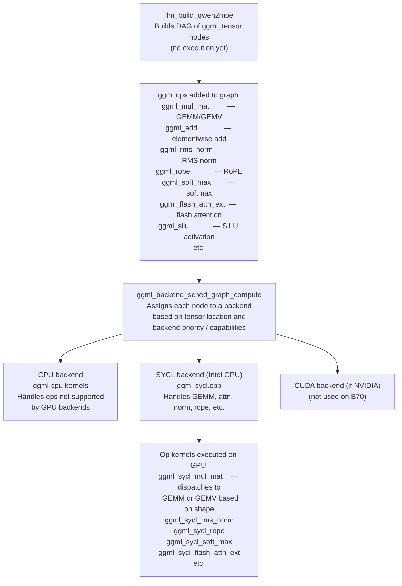
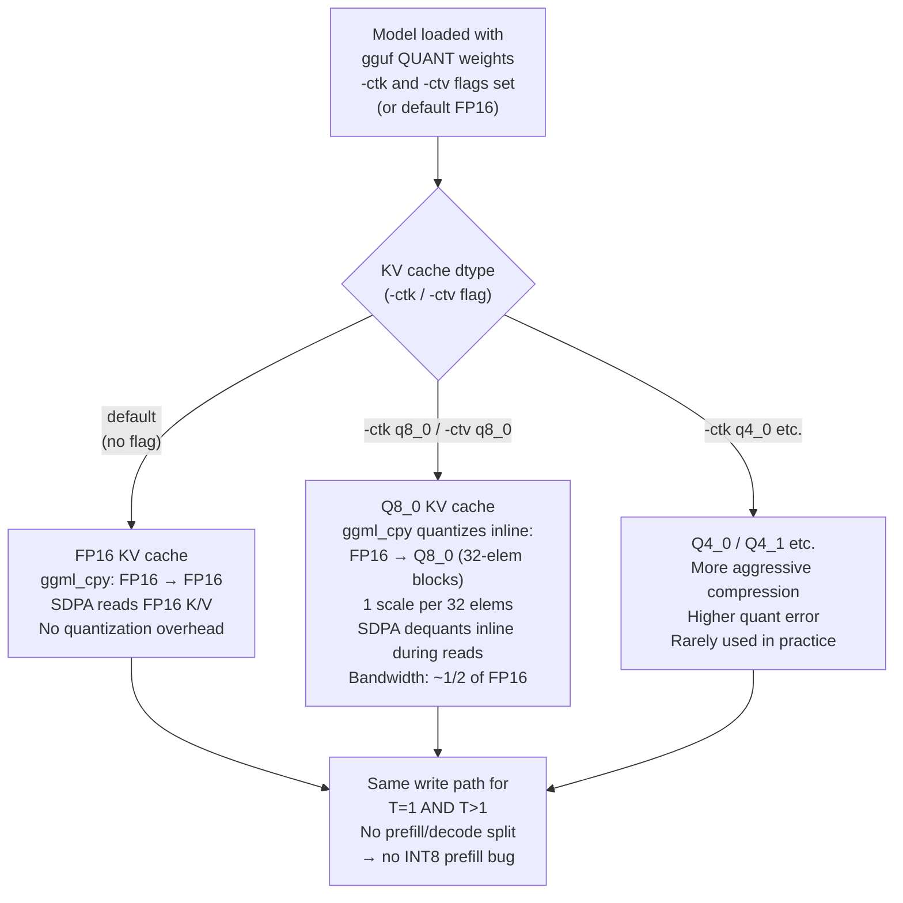

# llama.cpp — Architecture Diagrams (Qwen3-MoE Focus)

> **⚠️ Source of this document:** This is based on Claude's training knowledge of the llama.cpp
> codebase as of approximately August 2025. **It was NOT produced by reading the actual llama.cpp
> source files in this session.** Architecture details, function names, and file paths are accurate
> to the best of the author's knowledge but should be verified against the real codebase before
> acting on them. When in doubt, cross-reference against the llama.cpp GitHub repository.

---

## Table of Contents

1. [Overview & Architecture Philosophy](#1-overview--architecture-philosophy)
2. [Top-Level Inference Flow](#2-top-level-inference-flow)
3. [Computation Graph: How llama.cpp Executes Ops](#3-computation-graph-how-llamacpp-executes-ops)
4. [Qwen3-MoE Layer Structure](#4-qwen3-moe-layer-structure)
5. [KV Cache: Every Write and Read Point](#5-kv-cache-every-write-and-read-point)
6. [INT8 vs FP16 Decision Tree](#6-int8-vs-fp16-decision-tree)
7. [T=1 vs T>1 (Decode vs Prefill)](#7-t1-vs-t1-decode-vs-prefill)
8. [MoE Expert Routing](#8-moe-expert-routing)
9. [Backend Dispatch for Intel GPU (SYCL)](#9-backend-dispatch-for-intel-gpu-sycl)
10. [Kernel Inventory](#10-kernel-inventory)

---

## 1. Overview & Architecture Philosophy

**llama.cpp is a graph-based inference engine.** Unlike the IE engine (which calls kernels
imperatively), llama.cpp:

1. **Builds a computation graph** of `ggml_tensor` nodes and their ops (via `llm_build_*` functions).
2. **Schedules the graph** across one or more backends (CPU, CUDA, Metal, Vulkan, SYCL, …).
3. **Evaluates the graph** via `ggml_backend_sched_graph_compute()`.

This is a fundamentally different execution model:
- Individual op implementations live inside each backend (e.g., `ggml-cuda.cu`, `ggml-sycl.cpp`, `ggml-metal.m`).
- The graph builder in `llama.cpp` is backend-agnostic.
- KV cache management is separate from computation and handled by `llama_kv_cache`.

**Key source files** (approximate; verify against current codebase):
```
llama.cpp          — model loading, API surface, decode loop, KV cache mgmt
src/llama-model.cpp — model architecture definitions
src/llama-context.cpp — inference context (graph building, scheduling)
ggml/src/ggml.c    — tensor ops, graph builder
ggml/src/ggml-cpu/ — CPU backend kernels
ggml/src/ggml-cuda/ — CUDA backend
ggml/src/ggml-sycl/ — SYCL backend (Intel GPU)
ggml/src/ggml-metal/ — Metal backend (Apple)
ggml/src/ggml-vulkan/ — Vulkan backend
```

---

## 2. Top-Level Inference Flow

```
llama_new_context_with_model()
      │  Allocates KV cache, work buffers, backend scheduler
      ▼
llama_tokenize()
      │  BPE tokenization → token IDs
      ▼
llama_batch_init() + populate input tokens
      ▼
┌─────────────────────────────────────────────────────────┐
│  llama_decode(ctx, batch)                               │
│                                                         │
│  ① llm_decode()                                         │
│     → llama_build_graph()                               │
│        → calls model-specific builder:                  │
│           llm_build_qwen2moe() for Qwen3-MoE            │
│                                                         │
│  ② ggml_backend_sched_graph_compute()                   │
│     → schedules ops across backends                     │
│     → runs each op via its backend kernel               │
│                                                         │
│  ③ logits are placed in ctx->logits buffer              │
│     (last token only by default)                        │
└─────────────────────────────────────────────────────────┘
      │
      ▼
llama_sample_token() or llama_sampler_chain_apply()
      │  Sampler chain: temp → min-p → top-k → top-p → greedy/multinomial
      ▼
next token ID
```

---

## 3. Computation Graph: How llama.cpp Executes Ops



---

## 4. Qwen3-MoE Layer Structure

llama.cpp builds Qwen3-MoE (which is the same family as Qwen3.6-35B-A3B) using `llm_build_qwen2moe`.  
**Note:** For the specific hybrid Qwen3.6-35B-A3B model with DeltaNet layers, llama.cpp support may be absent or partial as of 2025 — this is a non-standard architecture not widely supported in standard llama.cpp.

```
Input token embeddings
      │
      ▼  (for each of N layers)
┌─────────────────────────────────────────────────────────────────┐
│  LAYER (standard transformer MoE, e.g. Qwen2.5-MoE)             │
│                                                                  │
│  ① attn_norm   ggml_rms_norm                                    │
│                                                                  │
│  ② Self-Attention                                                │
│     Q, K, V projections: ggml_mul_mat (with dequant for quant'd)│
│     RoPE:                ggml_rope                              │
│     SDPA:                ggml_flash_attn_ext  (if --flash-attn) │
│                          OR naive SDPA loop in ggml_mul_mat     │
│     GQA:                 handled inside flash attn / SDPA       │
│     Output proj:         ggml_mul_mat                           │
│                                                                  │
│  ③ Residual add          ggml_add                               │
│                                                                  │
│  ④ ffn_norm    ggml_rms_norm                                     │
│                                                                  │
│  ⑤ MoE FFN                                                       │
│     Router: ggml_mul_mat (F32 router weights × hidden)          │
│     Top-k:  CPU-side top-k + softmax + renorm                   │
│     Per-expert gate+up:  ggml_mul_mat × 2                       │
│     SwiGLU:              ggml_silu + ggml_mul                   │
│     Per-expert down:     ggml_mul_mat                           │
│     Weighted sum:        ggml_add with scale                    │
│                                                                  │
│  ⑥ Residual add          ggml_add                               │
└─────────────────────────────────────────────────────────────────┘
      │
      ▼
Final norm  ggml_rms_norm
lm_head     ggml_mul_mat (output weight)
logits      → sampler
```

---

## 5. KV Cache: Every Write and Read Point

### Cache Layout

```
llama.cpp KV cache struct: llama_kv_cache

Per layer:
  k_cache: [n_kv_heads, max_ctx, head_dim]  (dtype configurable)
  v_cache: [n_kv_heads, max_ctx, head_dim]  (dtype configurable)

Default dtype: FP16 (GGML_TYPE_F16)
Quantized dtype: configurable via CLI:
  -ctk q4_0    → Q4_0 keys
  -ctk q8_0    → Q8_0 keys (most common quantized option)
  -ctv q8_0    → Q8_0 values

Cell-based management:
  KV cells track which positions are occupied.
  llama_kv_cache_update() clears or defragments cells.
  Paging / prefix caching: llama_kv_cache_find_slot()
```

### Write and Read Points

```
┌──────────────────────────────────────────────────────────────────┐
│  WRITE (prefill AND decode, both use same graph path)            │
│                                                                  │
│  In llm_build_qwen2moe, K and V are written via:                │
│    ggml_cpy(K_new, k_cache[cur_cell..cur_cell+T])                │
│    ggml_cpy(V_new, v_cache[cur_cell..cur_cell+T])                │
│                                                                  │
│  If cache dtype is quantized (q8_0):                             │
│    ggml_cpy performs FP16→Q8_0 quantization inline              │
│    (one scale per block, block size = 32 for Q8_0)              │
│                                                                  │
│  Unlike the IE engine, llama.cpp uses the SAME write path for   │
│  both T=1 and T>1 (no separate prefill/decode branches for KV)  │
│  → no INT8 prefill bug equivalent                               │
└──────────────────────────────────────────────────────────────────┘

┌──────────────────────────────────────────────────────────────────┐
│  READ (inside flash attention or naive SDPA)                     │
│                                                                  │
│  Flash attention (--flash-attn flag):                            │
│    ggml_flash_attn_ext                                           │
│    Backend-specific tile-based implementation                   │
│    For SYCL backend: implemented in ggml-sycl.cpp               │
│    Supports KV cache quantization inline dequant                │
│                                                                  │
│  Without --flash-attn (default):                                 │
│    Naive SDPA via ggml_mul_mat:                                  │
│      scores = Q @ K_cache^T / sqrt(head_dim)                    │
│      softmax(scores + causal_mask)                              │
│      out = scores @ V_cache                                      │
│    Dequantization: handled by ggml_mul_mat dispatch             │
│    (reads quantized K/V, dequants on the fly in the kernel)     │
└──────────────────────────────────────────────────────────────────┘
```

---

## 6. INT8 vs FP16 Decision Tree



**Key difference from IE engine:** llama.cpp uses a unified write path for all T. The IE engine's INT8 bug (prefill writes only fp16, but decode tries to read INT8) cannot occur in llama.cpp's design because both prefill and decode use the same `ggml_cpy` path.

---

## 7. T=1 vs T>1 (Decode vs Prefill)

```
┌────────────────────────────────────────────────────────────────────┐
│  llama_decode() with batch of T tokens                              │
│                                                                     │
│  The computation GRAPH is identical for T=1 and T>1.               │
│  The graph is rebuilt each call (or cached/re-planned).            │
│                                                                     │
│  Differences by T:                                                 │
│                                                                     │
│  GEMM shape:                                                       │
│    T=1:  ggml_mul_mat with M=1 → backend dispatches as GEMV        │
│    T>1:  M>1 → backend dispatches as GEMM                         │
│    SYCL backend: ggml_sycl_mul_mat selects kernel variant          │
│                  based on shape at runtime                         │
│                                                                     │
│  Flash attention:                                                  │
│    T=1:  standard decode: Q[1,h,d] × K_cache^T, causal trivial    │
│    T>1:  prefill: Q[T,h,d] × K_cache^T, causal mask needed        │
│    Same ggml_flash_attn_ext kernel; shape drives inner tiling      │
│                                                                     │
│  KV cache writes:                                                  │
│    Both T=1 and T>1: ggml_cpy into cache cells (same path)         │
│                                                                     │
│  Logits:                                                           │
│    Default: only last token logits computed (lm_head on x[T-1])   │
│    With --logits-all: all T tokens' logits computed               │
└────────────────────────────────────────────────────────────────────┘
```

---

## 8. MoE Expert Routing

```
llm_build_qwen2moe — MoE FFN section:

ws_x_normed [T, hidden]
      │
      ▼
Router: ggml_mul_mat(ws_x_normed, W_router[n_experts, hidden])
  → logits [T, n_experts]  FP32

Top-k + softmax (typically on CPU, small tensor):
  → expert_ids [T, k]  INT32
  → expert_weights [T, k]  FP32  (renormalized)

For each expert e in active set:
  → gather tokens that route to expert e
  → gate_out = ggml_mul_mat(x_expert, W_gate_e)
  → up_out   = ggml_mul_mat(x_expert, W_up_e)
  → h_out    = ggml_mul(ggml_silu(gate_out), up_out)
  → down_out = ggml_mul_mat(h_out, W_down_e)
  → scatter-add with weight into output buffer

Shared expert (Qwen2-MoE uses shared expert):
  → same gate/up/silu/down path but weight=1 always applied

Notes:
  - Expert weights can be Q4_K_M, Q6_K etc. (from GGUF)
  - ggml_mul_mat dispatches to backend based on weight dtype
  - No equivalent of IE's fused moe_decode_gate_up_silu kernel:
    llama.cpp uses separate graph nodes per op
  - For T>1 (prefill), all active experts for all T tokens are
    dispatched; no special multi-expert batching beyond ggml_mul_mat
    shape optimization
```

---

## 9. Backend Dispatch for Intel GPU (SYCL)

```
ggml-sycl.cpp — Backend entry points:

ggml_sycl_mul_mat():
  Dispatches to:
  ┌─────────────────────────────────────────────────────────────────┐
  │  M=1, weight type = Q4_K:                                       │
  │    → mul_mat_vec_q4_K_q8_1_sycl (GEMV, dequant inline)         │
  │  M>1, weight type = Q4_K:                                       │
  │    → mul_mat_q4_K (tiled GEMM via convert+mul or DPAS)          │
  │  FP16 × FP16:                                                   │
  │    → sycl_joint_matrix or dpas_mul_mat                          │
  └─────────────────────────────────────────────────────────────────┘

ggml_sycl_flash_attn_ext():
  Flash attention on SYCL (Intel GPU):
  - WG-per-(batch, head) tiled SDPA
  - Supports KV quant dequant inline
  - Causal mask handled inside kernel

ggml_sycl_rms_norm():
  Per-row RMS normalization; WG reduction

ggml_sycl_rope():
  Rotary position embeddings; fused compute

Key SYCL-specific notes for Intel Arc B70:
  - DPAS (joint_matrix) enabled for FP16 GEMM when shapes align
  - SLM (shared local memory) = 64 KiB per subslice
  - KV cache quantization: SYCL backend dequants per ggml_mul_mat call
  - No dedicated FA-2 split-K: uses WG-per-head naive or standard flash
  - No equivalent of IE's per-layer full_attn_idx slicing:
    llama.cpp handles per-layer KV via the graph's tensor indexing
```

---

## 10. Kernel Inventory

> **Note:** Function names below are approximate. llama.cpp refactors frequently.
> Kernel names follow the pattern in ggml-sycl.cpp as of ~mid-2025.

### Core Compute (SYCL backend, ggml-sycl.cpp)

| Kernel (approx name) | Status | Used For | Notes |
|---|---|---|---|
| `mul_mat_vec_q4_K_q8_1_sycl` | ✅ Active | GEMV, Q4_K × FP16, M=1 | decode hot path |
| `mul_mat_vec_q6_K_sycl` | ✅ Active | GEMV, Q6_K × FP16, M=1 | |
| `mul_mat_q4_K` | ✅ Active | GEMM, Q4_K, M>1 | prefill |
| `rms_norm_sycl` | ✅ Active | LayerNorm | |
| `rope_neox_sycl` | ✅ Active | RoPE encoding | Qwen uses NeoX style |
| `flash_attn_ext_sycl` | ✅ Active | SDPA with flash attention | --flash-attn flag required |
| `soft_max_sycl` | ✅ Active | Softmax (naive SDPA path) | |
| `argsort_sycl` | ✅ Active | Top-k sampling | |
| `silu_sycl` | ✅ Active | SiLU activation | |
| `add_sycl` | ✅ Active | Element-wise add | residual connections |
| `dequant_row_q4_K_sycl` | ✅ Active | Inline dequant helper | called from mul_mat |
| `dequant_row_q6_K_sycl` | ✅ Active | Inline dequant helper | |

### CPU Ops (done on host in llama.cpp)

| Op | Notes |
|---|---|
| Top-k expert selection | Router logits are small (T × 256); done CPU-side in most backends |
| KV cache cell management | `llama_kv_cache_find_slot()` — host-side |
| Tokenization | BPE, host-side |
| Sampling | Mostly host-side after logit readback |

### Attention Variants

| Variant | How Enabled | Notes |
|---|---|---|
| Naive SDPA | default (no flag) | Q × K^T via ggml_mul_mat + softmax + × V; 3 separate ops |
| Flash Attention | `--flash-attn` CLI flag | ggml_flash_attn_ext; single fused kernel; recommended for long ctx |
| FA with KV quant | `--flash-attn -ctk q8_0` | Flash attn + inline Q8_0 dequant during K/V reads |

---

## Key Architecture Differences: IE Engine vs llama.cpp

| Aspect | IE Engine | llama.cpp |
|---|---|---|
| **Execution model** | Imperative: kernels called directly | Graph-based: build DAG, then schedule |
| **Backend** | Single SYCL backend (B70 only) | Multi-backend: CPU, CUDA, Metal, SYCL, Vulkan |
| **Attention (T=1)** | FA-2 split-K, custom SLM tile | Flash attn ext (--flash-attn) or naive |
| **Attention (T>1)** | Naive, fp16 only | Same kernel (FA or naive), handles both |
| **INT8 KV cache** | Per-row symmetric INT8 + scale (custom) | Block Q8_0 (32-elem blocks, 1 scale each) |
| **INT8 prefill** | ⚠️ BUG: prefill never writes INT8 | ✅ Unified: same ggml_cpy path for both T |
| **MoE dispatch** | Hand-fused kernels per T range | Separate graph nodes; ggml_mul_mat shape-driven |
| **DeltaNet layers** | ✅ Fully implemented | ❓ Non-standard arch, likely not supported |
| **Q4_K decode GEMV** | ~92% BW efficiency, custom kernel | ~60-80% BW efficiency (estimated, backend-dependent) |
| **ESIMD** | Researched; blocked by device-lost bug | N/A |
| **XMX (DPAS)** | joint_matrix for T>1 GEMM | DPAS/joint_matrix in SYCL backend |

---

*Based on training knowledge of llama.cpp as of ~August 2025. Not verified against live source code.*  
*Cross-reference: https://github.com/ggml-org/llama.cpp*
